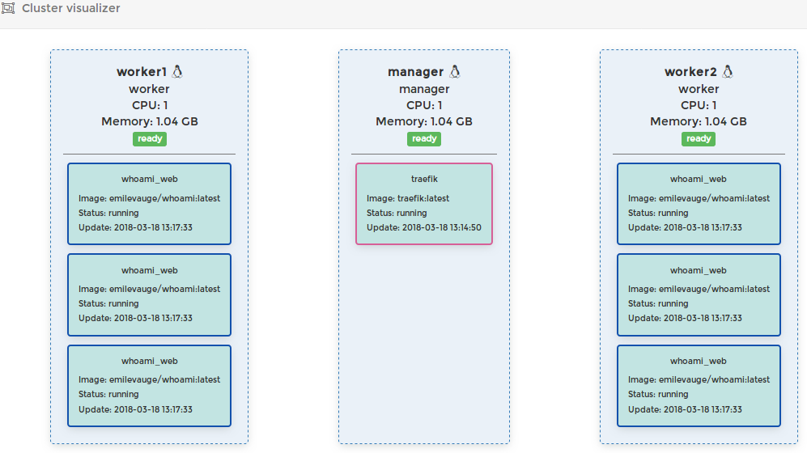

# swarm-virtualbox

Helpers to experiment `docker swarm`, `portainer` and `traefik` based on `docker-machine` and `virtualbox`.

## cluster initialization

* `bin/create-manager.sh` : create swarm manager node
* `bin/create-worker.sh <name>` : create swarm worker node

## DNS

* `bin/configure-dnsmasq` : configure dnsmasq to resolve `*.swarm-manager.vbox`

## Management UI

* `bin/start-portainer.sh` : start simple management UI for docker under http://swarm-manager.vbox:9000

## HTTP reverse proxy and load balancer

* `bin/start-traefik.sh` : start traefik

See http://swarm-manager.vbox:8080/dashboard/#/ 

## whoami

Helloworld service deployed to http://whoami.swarm-manager.vbox with traefik. 

